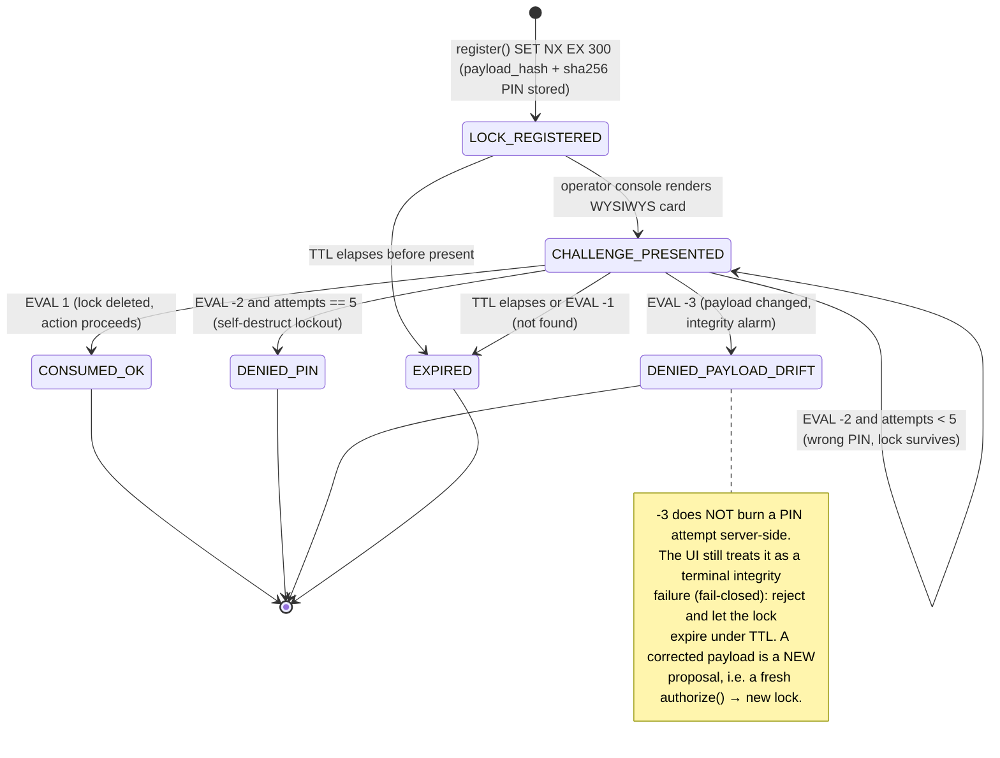

# ◐ MCPIP — Web Implementation Spec: Human-in-the-Loop Payload-Lock UI

> **MCPIP — The Authorization Layer for Autonomous AI.**
> Tagline: *Authorize every AI action before execution.*
> Philosophy: **AI Reasons. MCPIP Authorizes. Systems Execute.**
> Pipeline: `◐ Bridge → Obfuscator → Auth → Audit`

This document is the **frontend implementation contract** for the human-in-the-loop (HITL)
validation surface that renders MCPIP payload-lock challenges to a human operator and drives the
exactly-once lock consume. It is written for enterprise UI/integration engineers. Every JSON field
name in this document is drawn **verbatim** from `interfaces.py`; every enum value, limit, key
schema, and Lua return code matches the MCPIP V2 Master Engineering Spec to the byte. Where this
document defines a wire surface (REST/WebSocket), that surface is a thin embedding layer around the
framework-free gateway core (`main.py` ships **no** web framework); it changes no model and no
invariant.

Product one-liners this UI must reinforce:

- **MCPIP** — "The Authorization Layer for Autonomous AI."
- **Bridge** — "One ingress for every agent framework — OpenAI, Anthropic, raw MCP."
- **Obfuscator** — "Agents call aliases. Real systems stay invisible."
- **Auth** — "A payload-bound PIN that's spent exactly once, or the action never runs."
- **Audit** — "Every decision, hash-chained and signed — tamper-evident by construction."

---

## 1. Two trust boundaries — do not conflate them

MCPIP's fail-closed, opaque-error invariant governs the **agent boundary**. The HITL approval UI
lives on a **different, more-trusted boundary**. Getting this distinction right is the whole design.

| | **Agent boundary** (M2M) | **Operator console** (HITL) |
|---|---|---|
| Principal | Autonomous agent, authenticated by pinned-alg JWT (`EdDSA`/`RS256`) | Human operator, authenticated by an independent operator session (SSO + step-up) |
| May see the deny **reason** | **No** — only `correlation_id` + `"MCPIP: request denied by policy."` | **Yes** — the operator is the authorizer and must know *why* (wrong PIN vs payload drift) |
| May see the real transport **target** | **No** — obfuscated back to the alias | **No** — the hash binds the *alias*, so the card renders the alias, never `mainframe.cics.PAYR` |
| May see the payload **arguments** | Already owns them (it authored the call) | **Yes** — WYSIWYS renders the exact canonical payload |
| Holds the **PIN / authenticator** | **No** | **Yes** — the PIN/WebAuthn gesture never touches the agent path |

The agent that triggers a `pin_required` action **never** receives the PIN, the `lock_id`, the deny
reason, or the resolved target. It receives only an opaque `correlation_id`. Everything rich is
pushed to the authenticated operator console over a separate channel.

---

## 2. Lock lifecycle state machine

The payload lock (`mcpip:pinlock:{tenant_id}:{lock_id}`, `lock_id = uuid4().hex`) is registered with
`SET … NX EX 300` (`PIN_TTL_SECONDS = 300`) and consumed **exactly once** by a single Redis Lua
`EVAL` (fetch + compare + delete server-side — zero Python check-then-act). The UI is a projection of
that server-authoritative lock. It never invents a state the server did not report.



### 2.1 State ↔ Lua return code ↔ `DenyReason` mapping

`EVAL` order: `EVAL <LOCK_CONSUME_LUA> 1 KEYS[1] ARGV[1] ARGV[2] ARGV[3]` where `KEYS[1]` is the
tenant-scoped lock key, `ARGV[1] = sha256_hex(pin)`, `ARGV[2] = payload_hash`, `ARGV[3] = "5"`
(`PIN_MAX_ATTEMPTS`). The script compares **payload before PIN** (a tampered payload is denied
without spending an attempt).

| UI state | Lua code | Server truth | `DenyReason` at agent boundary | Retryable in UI |
|---|---|---|---|---|
| `LOCK_REGISTERED` | — | `SET NX EX 300` succeeded | — | n/a |
| `CHALLENGE_PRESENTED` | — | lock live, `attempts < 5` | — | yes |
| `CONSUMED_OK` | `1` | lock deleted, exactly-once | — (ALLOW) | no (terminal) |
| `DENIED_PIN` | `-2` (attempts hit 5) | lock self-destructed | `pin_mismatch` | no (terminal lockout) |
| `DENIED_PAYLOAD_DRIFT` | `-3` | payload hash ≠ stored | `payload_mismatch` | no (fail-closed terminal) |
| `EXPIRED` | `-1` **or** TTL | not found (expired / spent / replayed) | `pin_not_found` | no (terminal) |

`-1` is **ambiguous by design** (expired, already-consumed replay, or attempts-exhausted delete are
indistinguishable to the client). Per the fail-closed rule the UI collapses all `-1` outcomes into a
single terminal `EXPIRED` — never a retry, never an approvable state.

`-2` with `attempts_remaining > 0` is the **only** transition that returns to `CHALLENGE_PRESENTED`.
Every other non-`1` result is terminal.

---

## 3. Wire contracts

TLS is mandatory on every route below. `Content-Type: application/json; charset=utf-8`.

### 3.1 Agent boundary — REST (opaque, fail-closed)

`Authorization: Bearer <agent JWT>` (verified with algorithms pinned to `["EdDSA","RS256"]`;
`alg=none`/HMAC rejected). The body carries **no** identity-shaped field — `tenant_id`, `agent_id`,
`role` come exclusively from the verified JWT; an identity-shaped key anywhere inside `arguments` is a
hard deny (`identity_injection`), never a strip.

**`POST /v2/authorize`** — request body mirrors `NormalizedIntent` ingress plus its `source_format`:

```json
{
  "source_format": "raw_mcp",
  "raw_call": { "tool": "skill_payroll_run",
                "arguments": { "cycle": "2026-07", "run_type": "regular", "amount_usd": 481200 } },
  "trace": {
    "trace_id": "3f1c2e9a-8b04-4c1d-9f2a-77e0b6d1c9aa",
    "hops": [
      { "hop_index": 0, "agent_id": "agent-orchestrator-1", "parent_agent_id": null, "purpose": "run monthly payroll" }
    ]
  }
}
```

Responses at the agent boundary carry **only** `decision` + `correlation_id` (+ a redacted `result`
on allow). No reason, no `lock_id`, no target, no stack, ever.

> **Connector notes (agent boundary).** The `source_format` is **declared by the caller, never
> guessed** — the gateway selects a parser by the declared value (or a vendor id resolved through
> the pinned registry in `bridge/connectors/registry.py`), never by inspecting payload bytes; an
> unknown/absent declaration is a fail-closed deny (`unknown_format` / `unknown_vendor` in WORM,
> opaque on the wire). The connectors themselves are **parser-only** — no LLM/vendor SDK, no
> keys, no outbound calls (the client talks to its LLM on its own billing; MCPIP only ever sees
> the resulting tool-call). The MCP-native edge (`POST /v1/mcp` in `app/main.py`) is an
> **authorization boundary, not a proxy**: it never forwards to an upstream MCP server.

- **`200` ALLOW** (auto tier, or a consumed pin tier):
  ```json
  { "decision": "allow", "correlation_id": "9c84…f012", "result": { "ok": true, "target": "skill_payroll_run", "status_code": 0, "detail": "RC=0", "echo": {} } }
  ```
  `result` is a **projection** of the internal `TransportResult`: `target` is reverse-mapped back to
  the **alias** and `echo` is scrubbed of internal topology (`frame_hex`, `path`, encoding). The raw
  `TransportResult` (real target, EBCDIC frame hex) is written to WORM, never returned.
- **`202` PENDING** (a `pin_required` action awaiting human approval):
  ```json
  { "decision": "pending", "correlation_id": "9c84…f012", "expires_at_ns": 1752440000000000000 }
  ```
- **`403` DENY** — the *only* body the agent ever sees on failure:
  ```json
  { "decision": "deny", "correlation_id": "9c84…f012" }
  ```
  Message string, if surfaced in transport metadata, is exactly `"MCPIP: request denied by policy."`.

**`GET /v2/authorize/{correlation_id}`** — the agent polls for a terminal result of a `pending`
action. Returns the `200`/`403` shapes above once the operator resolves (or the lock expires). While
still pending it returns `202`. The agent may not consume, inspect, or cancel a lock.

> **Deviation note (documented, not a spec contradiction):** the library demo (`main.py`) treats a
> missing PIN on a `pin_required` alias as a terminal `DenyReason.PIN_REQUIRED`. The web embedding
> configures **challenge mode**: the same call registers the payload lock and returns `202 pending`
> instead of denying, then routes the challenge to the operator console. Same enum, same lock, same
> Lua — only the disposition of "no PIN yet" differs between batch-library and HITL-web deployments.

### 3.2 Operator console — WebSocket event stream

**`GET /v2/console/stream`** (Upgrade: websocket). Authenticated by the **operator** session cookie
(SameSite=Strict, Secure, HttpOnly) + a per-connection CSRF/subprotocol token — **not** the agent
JWT. The server subscribes the socket to challenges for the operator's own `tenant_id` only. The
socket carries three server→client event types. `tenant_id` is never read from the client; it is
bound from the operator session (identity sovereignty, mirrored to the human boundary).

**`challenge.presented`** — mirrors `AuthorizedIntent` (`intent` + `identity` + `correlation_id`)
plus the lock-specific fields the card needs. Every nested object matches `interfaces.py` field-for-field:

```json
{
  "type": "challenge.presented",
  "lock_id": "b7c3f1a29e0d4d67b1a2c3d4e5f60718",
  "correlation_id": "9c84a1b23d4e5f60718293a4b5c6d7e0",
  "risk_tier": "pin_required",
  "payload_hash": "4bae8468c5ff19252df4e33ba0c6e183acc4ce445b0010596b75918ec7a5bdcb",
  "payload_hash_prefix": "4bae8468c5ff",
  "canonical_payload": "{\"agent_id\":\"agent-orchestrator-1\",\"alias\":\"skill_payroll_run\",\"arguments\":{\"amount_usd\":481200,\"cycle\":\"2026-07\",\"run_type\":\"regular\"},\"tenant_id\":\"tenant-acme\"}",
  "created_ns": 1752439700000000000,
  "expires_at_ns": 1752440000000000000,
  "attempts_remaining": 5,
  "intent": {
    "alias": "skill_payroll_run",
    "arguments": { "amount_usd": 481200, "cycle": "2026-07", "run_type": "regular" },
    "trace": {
      "trace_id": "3f1c2e9a-8b04-4c1d-9f2a-77e0b6d1c9aa",
      "hops": [
        { "hop_index": 0, "agent_id": "agent-orchestrator-1", "parent_agent_id": null, "purpose": "run monthly payroll" }
      ]
    },
    "source_format": "raw_mcp"
  },
  "identity": {
    "tenant_id": "tenant-acme",
    "agent_id": "agent-orchestrator-1",
    "role": "ops",
    "issuer": "mcpip-demo-idp",
    "audience": "mcpip-gateway",
    "jti": "0f9e8d7c6b5a4938271605f4e3d2c1b0"
  }
}
```

The `payload_hash` above is the **real** SHA-256 of the `canonical_payload` string shown (verify:
`echo -n '{"agent_id":…}' | sha256sum` → `4bae8468c5ff…`). The card must recompute this hash locally
from the `canonical_payload` bytes and refuse to present if it disagrees with `payload_hash`
(defense against a compromised relay altering the display).

**`challenge.resolved`** — server→client terminal (or retry) outcome after a consume:

```json
{ "type": "challenge.resolved", "lock_id": "b7c3…0718", "correlation_id": "9c84…d7e0",
  "outcome": "denied_pin", "lua_code": -2, "attempts_remaining": 3, "resolved_ns": 1752439760000000000 }
```

`outcome ∈ { "consumed_ok", "denied_pin", "denied_payload_drift", "expired" }` — the snake_case
projection of the six-state machine's terminal/retry states (`CHALLENGE_PRESENTED` self-loop reports
`denied_pin` with `attempts_remaining > 0`).

**`challenge.expired`** — server→client TTL sweep (no consume attempt was made):

```json
{ "type": "challenge.expired", "lock_id": "b7c3…0718", "correlation_id": "9c84…d7e0", "expired_ns": 1752440000000000000 }
```

### 3.3 Operator console — REST consume

**`POST /v2/console/challenge/{lock_id}/consume`** — the human's approval gesture. Body echoes the
fields the server needs to recompute `lock_payload_hash(tenant_id, agent_id, alias, arguments)` — all
echoed **verbatim** from the `challenge.presented` event — plus the second factor. **`tenant_id` is
taken from the operator session and is never accepted from the body.**

```json
{
  "agent_id": "agent-orchestrator-1",
  "alias": "skill_payroll_run",
  "arguments": { "amount_usd": 481200, "cycle": "2026-07", "run_type": "regular" },
  "factor": "pin",
  "pin": "483920"
}
```

- The raw 6-digit `pin` (`^\d{6}$`) is sent over TLS. The client **must not** pre-hash it — the
  gateway computes `sha256_hex(pin.encode())` and stores only that hash server-side. The raw PIN is
  never persisted, never logged, and never written to WORM (redaction strips
  `{"pin","jwt","token","authorization","password","secret"}` recursively).
- Response body (operator boundary — reason **is** disclosed, because the operator is the authorizer):
  ```json
  { "outcome": "consumed_ok", "lua_code": 1, "correlation_id": "9c84…d7e0", "attempts_remaining": 5 }
  ```
- For WebAuthn, `factor: "webauthn"` with an `assertion` object replaces `pin` (see §7).

### 3.4 Field dictionary — every name traces to `interfaces.py`

| Wire field | Origin in `interfaces.py` | Notes |
|---|---|---|
| `intent.alias` | `NormalizedIntent.alias` | 1..256, `reject_unsafe_string` |
| `intent.arguments` | `NormalizedIntent.arguments` | depth ≤ 8, ≤ 16 KiB canonical, ≤ 64 keys/obj, ≤ 256/array |
| `intent.trace` | `NormalizedIntent.trace` (`SwarmTrace`) | |
| `intent.source_format` | `NormalizedIntent.source_format` (`SourceFormat`) | `openai_tool_call` \| `anthropic_tool_use` \| `raw_mcp` \| `gemini_function_call` \| `bedrock_tool_use` \| `mcp_jsonrpc` — declared by the caller, never sniffed |
| `trace.trace_id` | `SwarmTrace.trace_id` | must parse as UUID |
| `trace.hops[]` | `SwarmTrace.hops` | 1..16 (`MAX_CHAIN_HOPS`) |
| `hops[].hop_index` | `Hop.hop_index` | `0 ≤ n < 16`, equals list position |
| `hops[].agent_id` | `Hop.agent_id` | 1..256 |
| `hops[].parent_agent_id` | `Hop.parent_agent_id` | `null` only for hop 0 |
| `hops[].purpose` | `Hop.purpose` | 1..4096 |
| `identity.tenant_id` | `Identity.tenant_id` | from verified JWT / operator session only |
| `identity.agent_id` | `Identity.agent_id` | |
| `identity.role` | `Identity.role` | |
| `identity.issuer` | `Identity.issuer` | |
| `identity.audience` | `Identity.audience` | |
| `identity.jti` | `Identity.jti` | nullable |
| `correlation_id` | `AuthorizedIntent.correlation_id` | `uuid4().hex`, assigned at gateway entry |
| `result.ok` / `.target` / `.status_code` / `.detail` / `.echo` | `TransportResult` | `target` reverse-mapped to alias, `echo` scrubbed at the agent boundary |
| `risk_tier` | `RiskTier` | `auto` \| `pin_required` |
| `decision` | `Decision` | `allow` \| `deny` (+ web-only `pending`) |
| `payload_hash` | `lock_payload_hash(...)` | `sha256_hex(canonical_json({tenant_id,agent_id,alias,arguments}))`; equals the lock record's `payload` field |
| `created_ns` | lock record `created_ns` | |
| `attempts_remaining` | `PIN_MAX_ATTEMPTS − attempts` | server-derived from the lock record `attempts` |

---

## 4. WYSIWYS rendering rules (What You See Is What You Sign)

The lock binds `sha256_hex(canonical_json({"tenant_id","agent_id","alias","arguments"}))`. The
operator authorizes **exactly those four fields and nothing else**. The card is a faithful render of
the bytes under the hash — a paraphrase is a security defect.

1. **Render the canonical bytes, not a summary.** Display the exact `canonical_payload` string from
   the event in a monospace, `dir="ltr"`, `white-space: pre-wrap` block. Do **not** re-serialize
   from the parsed `arguments` object (key order, number formatting, and Unicode form could drift).
   The bytes shown must be the bytes hashed.
2. **Recompute and cross-check the hash client-side.** Compute `SHA-256` over the UTF-8 bytes of the
   displayed `canonical_payload` and assert equality with `payload_hash`. On mismatch → do **not**
   present an approvable card; render a `DENIED_PAYLOAD_DRIFT`-style integrity error (fail-closed).
3. **Show the hash prefix and correlation id, always visible, never truncated away.** Render
   `payload_hash_prefix` (first 12 hex — e.g. `4bae8468c5ff`) and the full `correlation_id` next to
   the Approve control so a screenshot of the card alone proves what was signed and traces to WORM.
   Offer a "reveal full hash" affordance for the 64-hex digest.
4. **Render the alias, never the resolved target.** The hash covers `alias` (`skill_payroll_run`),
   not `mainframe.cics.PAYR`. Displaying the target would render something *outside* the signature and
   also breaks obfuscation. The card shows the alias verbatim.
5. **No value transformation.** Do not localize numbers (`481200`, not `481,200`), do not reformat
   dates, do not translate strings, do not unescape. If a string value contains anything unusual it
   was already rejected at ingress by `reject_unsafe_string` (C0/C1 controls, bidi overrides
   `U+202A–U+202E`/`U+2066–U+2069`, zero-width `U+200B/200C/200D/2060/FEFF/00AD`); the card renders
   the post-NFC form as delivered.
6. **Diff, never merge.** If a follow-up challenge arrives for the same `trace_id`/alias with changed
   arguments, present it as a **new** challenge with its own hash — never silently update an
   already-presented card's values (that would decouple what's shown from what's signed).

---

## 5. PIN-pad component spec

The PIN pad captures the human's 6-digit second factor (`PIN_LENGTH = 6`) and submits it to
`/v2/console/challenge/{lock_id}/consume`. It is the weakest-typed surface, so it is the most tightly
constrained.

**Behavior**

- Six-digit decimal entry only. Reject non-`[0-9]` on input; enforce `^\d{6}$` before enabling
  Approve. Accept a pasted 6-digit block and OS OTP autofill (`autocomplete="one-time-code"`,
  `inputmode="numeric"`).
- **Masked by default**, with an explicit press-and-hold reveal. Never render the PIN into a
  DOM attribute that survives serialization, never place it in the URL/query string, never log it.
- **Client-side attempt mirror.** Track `attempts_remaining` from the last `challenge.resolved`; when
  it reaches `0`, disable entry and render the terminal `DENIED_PIN` lockout. This mirrors — never
  replaces — the server's authoritative 5-attempt self-destruct.
- **One in-flight consume at a time.** Disable Approve on submit; ignore double-fire. The Lua consume
  is exactly-once server-side, but the UI must not queue speculative attempts that burn the budget.
- **Zeroize on unmount / resolve / expiry.** Clear the PIN buffer from React state and any refs the
  moment the challenge resolves, expires, the socket drops, or the component unmounts.
- **No PIN in telemetry.** Analytics/error reporting must scrub the consume request body; only
  `lock_id`, `correlation_id`, and `outcome` are eligible for logging.

**Markup shape (accessible OTP field)**

```html
<label id="pinLabel" for="mcpip-pin">
  Authorization PIN for <strong>skill_payroll_run</strong> · hash 4bae8468c5ff
</label>
<input id="mcpip-pin" name="pin" type="text"
       inputmode="numeric" autocomplete="one-time-code"
       pattern="\d{6}" maxlength="6" minlength="6"
       aria-describedby="pinHash pinAttempts" aria-labelledby="pinLabel"
       autocapitalize="off" spellcheck="false" enterkeyhint="done" required />
<p id="pinHash">Signing payload 4bae8468c5ff… · correlation 9c84a1b2…</p>
<p id="pinAttempts" aria-live="polite">Attempts remaining: 5</p>
```

An on-screen keypad (for kiosk/touch operator stations) renders buttons `0–9`, `⌫`, arranged in a
`3×4` grid, each `≥ 44 × 44 px`, fully keyboard-operable (`role="group"`, arrow-key roving tabindex),
feeding the same `#mcpip-pin` model. The single text input remains the source of truth so paste/OTP
autofill and screen readers keep working.

---

## 6. Accessibility requirements

The approval card is a modal decision surface; it must be operable by keyboard and screen reader with
zero mouse.

- **Dialog semantics.** `role="dialog"`, `aria-modal="true"`, `aria-labelledby` → card title,
  `aria-describedby` → the WYSIWYS block. Trap focus within the card while open; restore focus to the
  triggering element on close.
- **Initial focus** lands on the WYSIWYS payload region (`tabindex="-1"`, `role="document"`), **not**
  on the Approve button — the operator must read before they can act.
- **Announce state changes.** The hash prefix, `attempts_remaining`, countdown, and terminal outcome
  live in `aria-live="polite"` regions (`assertive` for `DENIED_PAYLOAD_DRIFT` and expiry). Outcomes
  are conveyed by text + icon, never color alone.
- **Contrast & motion.** WCAG 2.2 AA contrast (≥ 4.5:1 text, ≥ 3:1 UI) in both light and dark themes;
  honor `prefers-reduced-motion` (no spinner-only countdown — use a text timer). Theme is derived
  from `prefers-color-scheme` with an explicit override.
- **Target size** ≥ 24 × 24 CSS px (keypad keys ≥ 44 px). Labels are programmatic, not placeholder-only.
- **No timeouts that surprise.** The expiry countdown is visible and announced; on expiry the card
  moves to a clearly-labeled terminal state rather than vanishing.

---

## 7. WebAuthn upgrade path (cryptographic WYSIWYS)

WebAuthn is the documented step-up from the 6-digit PIN. It is an **upgrade path** (shipped code uses
the PIN; this is the JWKS-style extension point) that layers a phishing-resistant, hardware-bound
gesture in front of the *same* atomic Lua consume — the lock contract, return codes, and
exactly-once delete are unchanged.

The move that matters: **the WebAuthn challenge is the payload hash itself.** The authenticator signs
over `clientDataJSON`, which embeds `challenge = base64url(payload_hash_bytes)`. The human's hardware
gesture therefore signs the *exact* 32-byte SHA-256 of the canonical payload. One byte of drift → a
different hash → a signature the server rejects. This is the strongest possible WYSIWYS: what the
operator sees is cryptographically what they sign.

**Assertion (browser)** — `navigator.credentials.get`, challenge bound to the payload hash:

```ts
async function assertOverPayload(ev: ChallengePresented): Promise<PublicKeyCredential> {
  // Transient user activation is REQUIRED by the WebAuthn spec and by MCPIP's gating rule.
  if (!navigator.userActivation?.isActive) throw new Error("no user activation");

  const challenge = hexToBytes(ev.payload_hash);          // the 32-byte SHA-256, verbatim
  const assertion = await navigator.credentials.get({
    publicKey: {
      challenge,                                            // ← payload hash IS the challenge
      rpId: location.hostname,
      allowCredentials: [/* operator's registered credential ids */],
      userVerification: "required",                        // PIN/biometric on the authenticator
      timeout: 60_000,
    },
  });
  return assertion as PublicKeyCredential;
}
```

**Consume (`factor: "webauthn"`)** — the assertion replaces the PIN in the consume body:

```json
{
  "agent_id": "agent-orchestrator-1",
  "alias": "skill_payroll_run",
  "arguments": { "amount_usd": 481200, "cycle": "2026-07", "run_type": "regular" },
  "factor": "webauthn",
  "assertion": {
    "id": "…credentialId (base64url)…",
    "rawId": "…",
    "type": "public-key",
    "response": {
      "clientDataJSON": "…base64url; .challenge === base64url(payload_hash)…",
      "authenticatorData": "…base64url…",
      "signature": "…base64url…",
      "userHandle": "…base64url…"
    }
  }
}
```

**Server-side (verbatim invariants preserved):**

1. Verify the assertion against the operator's registered credential public key
   (`cryptography`), assert `type === "webauthn.get"`, `rpIdHash` matches, `UV` flag set, and
   `signCount` advances.
2. Assert `clientData.challenge` (base64url-decoded) equals the raw `payload_hash` bytes of the
   lock — using `secrets.compare_digest` on the hex.
3. Only then run the **same** `LOCK_CONSUME_LUA` `EVAL` to consume the lock exactly once. The payload
   comparison inside the script (`ARGV[2]`) still runs, so drift is caught twice — cryptographically
   in the assertion and again server-side in Lua. Return codes `1 / -1 / -2 / -3` are unchanged.

Because a WebAuthn assertion already binds the payload, the six-digit brute-force surface disappears;
the `attempts`/`PIN_MAX_ATTEMPTS` counter remains only for PIN-tier locks.

---

## 8. Anti-clickjacking & user-activation gating

A HITL authorization control is a prime clickjacking / redress target. It must be impossible to have
the operator approve something they cannot see, or to auto-submit without a genuine gesture.

**Response headers on every console route (REST + the WS upgrade origin):**

```
Content-Security-Policy: frame-ancestors 'none'; default-src 'self'; base-uri 'none'; form-action 'self'; object-src 'none'
X-Frame-Options: DENY
Cross-Origin-Opener-Policy: same-origin
Cross-Origin-Embedder-Policy: require-corp
Cross-Origin-Resource-Policy: same-origin
Permissions-Policy: publickey-credentials-get=(self), otp-credentials=(self)
Referrer-Policy: no-referrer
Strict-Transport-Security: max-age=63072000; includeSubDomains; preload
Cache-Control: no-store
```

`frame-ancestors 'none'` (plus legacy `X-Frame-Options: DENY`) forbids embedding the console in any
frame — no overlay, no opacity trick.

**Frame-busting belt-and-suspenders (client):**

```ts
if (window.top !== window.self) {
  // Refuse to render any approval affordance if we were framed despite CSP.
  renderTerminal("DENIED", "Console must not be embedded.");
  throw new Error("framed context — fail closed");
}
```

**User-activation gating.** Every consume — PIN submit *and* WebAuthn get — must be dispatched only
from a real user gesture:

```ts
function onApprove(ev: React.MouseEvent | React.KeyboardEvent) {
  if (!navigator.userActivation?.isActive) return; // no synthetic / programmatic approvals
  submitConsume();
}
```

Approve is disabled until the WYSIWYS hash cross-check passes (§4.2), the field satisfies `^\d{6}$`
(or a WebAuthn credential is selected), and the lock is not expired. Never auto-focus-and-submit,
never bind Approve to a timer, never approve on socket message. WebAuthn additionally requires
transient activation by its own spec — do not attempt `credentials.get` outside a click/keypress
handler.

---

## 9. TypeScript interface snippets

These mirror `interfaces.py` one-to-one; enum unions carry the exact string values from §1.1 of the
engineering spec.

```ts
// ---- enums (string values are load-bearing; match interfaces.py) ----
export type SourceFormat =
  | "openai_tool_call" | "anthropic_tool_use" | "raw_mcp"
  | "gemini_function_call" | "bedrock_tool_use" | "mcp_jsonrpc";
export type RiskTier     = "auto" | "pin_required";
export type Decision     = "allow" | "deny";              // web layer adds transient "pending"

export type DenyReason =
  | "identity_injection" | "unknown_format"   | "unknown_vendor"
  | "schema_violation"
  | "depth_exceeded"     | "size_exceeded"    | "illegal_character"
  | "unknown_alias"      | "cross_tenant"     | "jwt_invalid"
  | "jwt_claims_missing" | "pin_required"     | "pin_not_found"
  | "pin_mismatch"       | "payload_mismatch" | "lock_error"
  | "transport_error"    | "rate_limited"     | "internal"
  | "compartment_denied" | "capability_denied";

// ---- ingress / identity models (match interfaces.py field-for-field) ----
export interface Hop {
  hop_index: number;                 // 0 <= n < 16 (MAX_CHAIN_HOPS)
  agent_id: string;                  // 1..256
  parent_agent_id: string | null;    // null only for hop 0
  purpose: string;                   // 1..4096 (MAX_STRING_LEN)
}
export interface SwarmTrace {
  trace_id: string;                  // UUID
  hops: Hop[];                       // 1..16
}
export interface NormalizedIntent {
  alias: string;                     // 1..256
  arguments: Record<string, unknown>;
  trace: SwarmTrace;
  source_format: SourceFormat;
}
export interface Identity {
  tenant_id: string;
  agent_id: string;
  role: string;
  issuer: string;
  audience: string;
  jti: string | null;
}
export interface AuthorizedIntent {
  intent: NormalizedIntent;
  identity: Identity;
  correlation_id: string;            // uuid4 hex
}
export interface TransportResult {
  ok: boolean;
  target: string;                    // alias at the agent boundary (reverse-mapped)
  status_code: number;               // 0 for mainframe RC=0
  detail: string;
  echo: Record<string, unknown>;     // scrubbed of internal topology at the agent boundary
}

// ---- lock lifecycle (web-layer, consistent with the state machine) ----
export type LockState =
  | "LOCK_REGISTERED" | "CHALLENGE_PRESENTED"
  | "CONSUMED_OK" | "DENIED_PIN" | "DENIED_PAYLOAD_DRIFT" | "EXPIRED";

export type LuaCode = 1 | -1 | -2 | -3;
export type ConsumeOutcome =
  | "consumed_ok" | "denied_pin" | "denied_payload_drift" | "expired";

// ---- WebSocket events ----
export interface ChallengePresented {
  type: "challenge.presented";
  lock_id: string;
  correlation_id: string;
  risk_tier: RiskTier;               // "pin_required"
  payload_hash: string;              // 64 hex, = sha256(canonical_payload)
  payload_hash_prefix: string;       // first 12 hex
  canonical_payload: string;         // EXACT canonical_json bytes (utf-8) — render verbatim
  created_ns: number;
  expires_at_ns: number;
  attempts_remaining: number;        // starts at PIN_MAX_ATTEMPTS = 5
  intent: NormalizedIntent;
  identity: Identity;
}
export interface ChallengeResolved {
  type: "challenge.resolved";
  lock_id: string;
  correlation_id: string;
  outcome: ConsumeOutcome;
  lua_code: LuaCode;
  attempts_remaining: number;
  resolved_ns: number;
}
export interface ChallengeExpired {
  type: "challenge.expired";
  lock_id: string;
  correlation_id: string;
  expired_ns: number;
}
export type ConsoleEvent = ChallengePresented | ChallengeResolved | ChallengeExpired;

// ---- consume request ----
export interface ConsumeRequestBase {
  agent_id: string;                  // echoed verbatim from challenge.identity.agent_id
  alias: string;                     // echoed verbatim from challenge.intent.alias
  arguments: Record<string, unknown>;// echoed VERBATIM from challenge.intent.arguments
}                                     // tenant_id comes from the operator session, never the body
export interface ConsumePinRequest    extends ConsumeRequestBase { factor: "pin"; pin: string; }
export interface ConsumeWebAuthnRequest extends ConsumeRequestBase { factor: "webauthn"; assertion: unknown; }
export type ConsumeRequest = ConsumePinRequest | ConsumeWebAuthnRequest;
```

---

## 10. Sample React approval card (sketch)

Illustrative — shows the load-bearing rules (WYSIWYS hash cross-check, user-activation gating,
frame-bust, fail-closed rendering, PIN zeroization). Not a full application.

```tsx
import { useEffect, useMemo, useRef, useState } from "react";
import type { ChallengePresented, ConsumeOutcome } from "./mcpip-types";

const PIN_RE = /^\d{6}$/;

// SHA-256 of the displayed canonical bytes; must equal event.payload_hash (WYSIWYS rule §4.2).
async function sha256Hex(s: string): Promise<string> {
  const buf = await crypto.subtle.digest("SHA-256", new TextEncoder().encode(s));
  return [...new Uint8Array(buf)].map((b) => b.toString(16).padStart(2, "0")).join("");
}

type Terminal = ConsumeOutcome | null;

export function ApprovalCard({ ev }: { ev: ChallengePresented }) {
  const [pin, setPin] = useState("");
  const [hashOk, setHashOk] = useState<boolean | null>(null); // null = still verifying
  const [terminal, setTerminal] = useState<Terminal>(null);
  const [attempts, setAttempts] = useState(ev.attempts_remaining);
  const [now, setNow] = useState(() => Date.now() * 1e6);
  const busy = useRef(false);

  // Anti-clickjacking: refuse to render an approvable card inside a frame (fail closed).
  const framed = typeof window !== "undefined" && window.top !== window.self;

  // WYSIWYS cross-check: recompute the hash from the exact bytes we display.
  useEffect(() => {
    let live = true;
    sha256Hex(ev.canonical_payload).then((h) => {
      if (live) setHashOk(h.toLowerCase() === ev.payload_hash.toLowerCase());
    });
    return () => { live = false; };
  }, [ev.canonical_payload, ev.payload_hash]);

  // Visible, announced expiry countdown; expiry is terminal (fail closed).
  useEffect(() => {
    const t = setInterval(() => setNow(Date.now() * 1e6), 1000);
    return () => clearInterval(t);
  }, []);
  const expired = now >= ev.expires_at_ns;
  const secondsLeft = Math.max(0, Math.floor((ev.expires_at_ns - now) / 1e9));

  // Zeroize the PIN on any exit path.
  useEffect(() => () => setPin(""), []);
  useEffect(() => { if (terminal || expired) setPin(""); }, [terminal, expired]);

  const canApprove =
    !framed && hashOk === true && !expired && !terminal && attempts > 0 && PIN_RE.test(pin);

  async function onApprove(e: React.SyntheticEvent) {
    e.preventDefault();
    if (!canApprove || busy.current) return;
    if (!navigator.userActivation?.isActive) return; // user-activation gating (§8)
    busy.current = true;
    try {
      const res = await fetch(`/v2/console/challenge/${ev.lock_id}/consume`, {
        method: "POST",
        headers: { "Content-Type": "application/json" },
        credentials: "same-origin",
        body: JSON.stringify({
          agent_id: ev.identity.agent_id,   // echoed verbatim
          alias: ev.intent.alias,           // echoed verbatim
          arguments: ev.intent.arguments,   // echoed VERBATIM — drift here = payload_mismatch
          factor: "pin",
          pin,                              // raw 6-digit, TLS only; server hashes it
        }),
      });
      setPin(""); // zeroize immediately after send
      if (!res.ok) { setTerminal("expired"); return; } // ambiguous → fail closed
      const body = (await res.json()) as { outcome: ConsumeOutcome; attempts_remaining: number };
      setAttempts(body.attempts_remaining);
      // -2 with attempts left is the only non-terminal outcome; else lock the card.
      if (body.outcome === "denied_pin" && body.attempts_remaining > 0) return;
      setTerminal(body.outcome);
    } catch {
      setTerminal("expired"); // network/timeout ambiguity → denied (fail closed)
    } finally {
      busy.current = false;
    }
  }

  if (framed) return <TerminalBanner outcome="denied_payload_drift" note="Console must not be embedded." />;
  if (hashOk === false) return <TerminalBanner outcome="denied_payload_drift" note="Payload hash mismatch." />;
  if (terminal) return <TerminalBanner outcome={terminal} />;
  if (expired) return <TerminalBanner outcome="expired" />;
  if (hashOk === null) return <p aria-live="polite">Verifying payload integrity…</p>;

  return (
    <section role="dialog" aria-modal="true" aria-labelledby="cardTitle" aria-describedby="wysiwys">
      <h2 id="cardTitle">◐ Authorize <code>{ev.intent.alias}</code></h2>

      {/* WYSIWYS: the EXACT canonical bytes under the hash — never a paraphrase (§4). */}
      <pre id="wysiwys" tabIndex={-1} dir="ltr"
           style={{ whiteSpace: "pre-wrap", fontFamily: "ui-monospace, monospace" }}>
        {ev.canonical_payload}
      </pre>

      <dl>
        <dt>Payload hash</dt>
        <dd><code>{ev.payload_hash_prefix}</code>… (SHA-256 verified locally)</dd>
        <dt>Correlation id</dt>
        <dd><code>{ev.correlation_id}</code></dd>
        <dt>Expires in</dt>
        <dd aria-live="polite">{secondsLeft}s</dd>
      </dl>

      <form onSubmit={onApprove}>
        <label htmlFor="mcpip-pin">Authorization PIN</label>
        <input id="mcpip-pin" value={pin}
               onChange={(e) => setPin(e.target.value.replace(/\D/g, "").slice(0, 6))}
               inputMode="numeric" autoComplete="one-time-code" pattern="\d{6}"
               maxLength={6} required aria-describedby="attempts" />
        <p id="attempts" aria-live="polite">Attempts remaining: {attempts}</p>
        <button type="submit" disabled={!canApprove}>Approve</button>
      </form>
    </section>
  );
}

function TerminalBanner({ outcome, note }: { outcome: ConsumeOutcome; note?: string }) {
  const copy: Record<ConsumeOutcome, string> = {
    consumed_ok: "Approved — action authorized and executing.",
    denied_pin: "Denied — PIN lockout. This challenge is closed.",
    denied_payload_drift: "Denied — the action changed since it was proposed. Not authorized.",
    expired: "This challenge is no longer available.",
  };
  return (
    <p role="status" aria-live={outcome === "consumed_ok" ? "polite" : "assertive"}>
      {copy[outcome]}{note ? ` (${note})` : ""}
    </p>
  );
}
```

---

## 11. Error, expiry & fail-closed UX rules

Ambiguity resolves to **denied**. Every uncertain condition renders as a non-approvable terminal
state; the UI never presents an approvable control when it cannot prove the lock is live and the
payload is intact.

| Condition | Server signal | UI renders | Retry? |
|---|---|---|---|
| WYSIWYS hash mismatch (client recompute ≠ `payload_hash`) | — (local) | `DENIED_PAYLOAD_DRIFT`, assertive | no |
| Consume `1` | `lua_code 1` / `outcome consumed_ok` | `CONSUMED_OK` | no |
| Wrong PIN, attempts remain | `-2`, `attempts_remaining > 0` | stays `CHALLENGE_PRESENTED`, decrement, announce | yes |
| Wrong PIN, lockout | `-2`, `attempts_remaining == 0` | `DENIED_PIN` (terminal) | no |
| Payload drift | `-3` / `payload_mismatch` | `DENIED_PAYLOAD_DRIFT`, assertive alarm | no |
| Not found (expired / spent / replay) | `-1` / `pin_not_found` | `EXPIRED` (single terminal bucket) | no |
| TTL countdown hits 0 | `challenge.expired` or countdown | `EXPIRED` | no |
| HTTP `5xx`, timeout, malformed body | — | `EXPIRED`/denied (ambiguous → fail closed) | no |
| WebSocket disconnect while presented | socket close | void the card: "Connection lost — challenge is no longer valid" | no |
| Duplicate `challenge.resolved` | idempotent | ignore (already terminal) | no |

Additional rules:

- **Never surface a `DenyReason` at the agent boundary.** The `403` body is `{decision, correlation_id}`
  only. Reasons are for the operator console and the WORM log — the agent path stays opaque.
- **Never guess a status.** If the socket is stale, re-derive from `GET /v2/authorize/{correlation_id}`
  (agent side) or re-subscribe (console side); do not paint a stale `CHALLENGE_PRESENTED`.
- **Loud on drift.** `DENIED_PAYLOAD_DRIFT` is the one outcome that means active tampering — surface
  it assertively (aria-live assertive, distinct iconography), and it is always terminal in the UI even
  though `-3` leaves the server lock alive to expire under TTL.
- **No PIN survives a terminal state.** Zeroize on resolve, expiry, disconnect, and unmount.

---

## 12. Security invariants honored by this UI

| Invariant | How the web layer honors it |
|---|---|
| TOCTOU payload lock, exactly-once | Consume is a single server-side Lua `EVAL`; the UI never checks-then-acts, never consumes locally, submits one attempt at a time. |
| Timing safety | Server compares PIN-hash, payload hash, and WebAuthn challenge with `secrets.compare_digest`. The client only *cross-checks* the display hash (no secret involved). |
| Deep schema rigidity | All ingress is validated by the `extra="forbid", strict=True` models before a lock is ever registered; the card renders only already-sanitized (NFC, no bidi/zero-width/control) values. |
| M2M identity sovereignty | `tenant_id`/`agent_id`/`role` come from the verified JWT (agent) and the operator session (console) — never from a request body; identity-shaped keys in `arguments` are a hard deny. |
| Fail-closed, opaque errors | Agent `403` carries only `correlation_id`; ambiguous UI states render as denied; no stack/path/target/key-name crosses the agent boundary. |
| Stateless nodes | All lock/attempt/TTL state lives in Redis; the UI derives everything from server events and never caches authoritative lock state. |
| Obfuscation | The card and the agent `result` render the **alias**; the resolved target (`mainframe.cics.PAYR`, EBCDIC frame hex) goes to WORM only. |

---

## 13. Quickstart (identical across `README.md` and `IMPLEMENTATION_WEB.md`)

```bash
# Redis (host port 63790 -> container 6379); reuse if the container already exists
docker run -d --name mcpip-v2-redis -p 63790:6379 redis:7-alpine \
  || docker start mcpip-v2-redis

/opt/homebrew/bin/python3.12 -m venv .venv
source .venv/bin/activate
pip install -r requirements.txt

export MCPIP_REDIS_URL=redis://localhost:63790/0   # default; optional
python main.py         # runs the 10-gate demo, exits 0 iff all hold
```

The console/agent web surfaces described here embed the same framework-free gateway core. The
gateway's own default Redis URL is `redis://localhost:63790/0` (host-run demo); in-compose the
gateway reaches Redis at `redis://redis:6379/0` on the compose network — note the host↔compose port
asymmetry (`63790` vs `6379`).

---

## 14. Consistency checklist (self-verify before shipping the UI)

1. Every JSON field name traces to a `interfaces.py` model field (§3.4 dictionary). ✔
2. Enum string values used verbatim: `SourceFormat` (`openai_tool_call`/`anthropic_tool_use`/
   `raw_mcp`/`gemini_function_call`/`bedrock_tool_use`/`mcp_jsonrpc`),
   `RiskTier` (`auto`/`pin_required`), `Decision` (`allow`/`deny`), all 21 `DenyReason` values. ✔
3. Lua return codes mapped exactly: `1 → consumed_ok`, `-1 → expired` (ambiguous, fail-closed),
   `-2 → denied_pin` (retry while `attempts_remaining > 0`, else lockout), `-3 → denied_payload_drift`. ✔
4. Limits surfaced correctly: `PIN_LENGTH = 6`, `PIN_TTL_SECONDS = 300`, `PIN_MAX_ATTEMPTS = 5`,
   `MAX_STRING_LEN = 4096`, `MAX_ARG_DEPTH = 8`, `MAX_CANONICAL_BYTES = 16384`, `MAX_CHAIN_HOPS = 16`. ✔
5. WYSIWYS renders the exact `canonical_json({tenant_id,agent_id,alias,arguments})` bytes; hash
   prefix + `correlation_id` always visible; alias shown, target never. ✔
6. Agent boundary stays opaque (`{decision, correlation_id}` on deny; `"MCPIP: request denied by policy."`). ✔
7. Anti-clickjacking (`frame-ancestors 'none'` + `X-Frame-Options: DENY` + frame-bust) and
   user-activation gating on every consume. ✔
8. Redis default `redis://localhost:63790/0`; Quickstart block identical to README/PITCH_DECK. ✔
