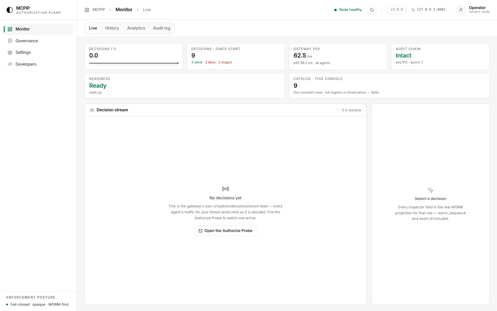

# An organization on MCPIP — many agents, many people, in parallel

A companion to [`E2E_WALKTHROUGH.md`](E2E_WALKTHROUGH.md), which follows a single
call end to end. This one asks the other question: what does it look like when a
whole organization runs on the gateway — several teams' agents firing
concurrently, several kinds of human alongside them, and an incident in the
middle of it.

Every number, status code and ledger row below came from a real run against a
production-posture `3.0.0` gateway (`MCPIP_SANDBOX_MODE=false`).

---

## 1. The organization

One tenant, `acme-platform`. Eight machine identities and four kinds of human,
all minted by the same IdP, all verified by the gateway against one public key.

| principal | role claim | capability | what it is |
|---|---|---|---|
| `cf-agent-a`, `cf-agent-b` | `platform-ops` | — | Cloudflare infrastructure agents |
| `gh-agent-a`, `gh-agent-b` | `release-ops` | — | GitHub release agents |
| `ci-agent-1` | `ci` | — | build pipeline |
| `data-agent-1` | `analytics` | — | analytics agent |
| `mcpip-admin` | `platform-admin` | `CAP_DIRECTORY_ADMIN` | platform operator |
| `auditor-1` | `auditor` | `CAP_FORENSIC_READ` | compliance / IR |
| `reviewer-1` | `reviewer` | `CAP_CATALOG_REVIEWER` | extension reviewer |

`role` is a **descriptive** claim and authorizes nothing. The capability UUID is
the entitlement. An agent with `role: "platform-admin"` and no capability is an
ordinary agent.

## 2. Everyone at once

72 authorize calls from six agents, 24 in flight at a time, against the
production gateway:

```
fired 72 concurrent authorize calls in 0.21s  (336 req/s, 24 workers)
latency  p50=61.1ms  p95=89.3ms  max=98.7ms

agent           alias                     200  202  403
cf-agent-a      cf.d1.databases.list       12    0    0
cf-agent-b      cf.d1.databases.list       12    0    0
gh-agent-a      gh.branches.list           12    0    0
gh-agent-b      gh.branches.list           12    0    0
ci-agent-1      gh.branches.list           12    0    0
data-agent-1    cf.d1.query                 0    0   12
```

Two things to read here.

**Concurrency does not blur attribution.** Every one of the 72 decisions carries
its own correlation id, its own `worm_sequence`, and the verified `agent_id` of
the caller. Six agents interleaving at 336 req/s produce six cleanly separable
audit trails, not one merged stream.

**One agent's posture does not leak into another's.** `data-agent-1` reached for
`cf.d1.query` — a `pin_required`, `restricted` alias — and was refused all 12
times while five peers ran clean at full rate. The refusal is per-call and
per-identity; there is no circuit that trips for everyone.

Every `403` above is byte-identical to the caller. The reasons live in the
ledger, not in the response.

### 2.1 Same run, six distinct client hosts

The run above shares a process and a source address, which is not what an
organization looks like. Repeated with each agent dialling from its **own
loopback source IP**, so the gateway sees six separate client hosts opening
independent connections:

```
6 agents x 25 calls = 150 requests, each agent from its OWN source IP
wall 0.44s  ->  344 req/s
latency p50=16.0ms  p95=28.2ms  max=38.5ms

agent         source ip   alias                     200  202  403
cf-agent-a    127.0.0.2   cf.d1.databases.list       25    0    0
cf-agent-b    127.0.0.3   cf.d1.databases.list       25    0    0
gh-agent-a    127.0.0.4   gh.branches.list           25    0    0
gh-agent-b    127.0.0.5   gh.pr.list                 25    0    0
ci-agent-1    127.0.0.6   gh.branches.list           25    0    0
data-agent-1  127.0.0.7   cf.d1.query                 0    0   25
```

No transport errors, and the verdicts are identical to the shared-source run:
distinct hosts change throughput characteristics, not decisions.

### 2.2 The network contributes nothing to identity

Worth proving rather than assuming. The same `cf-agent-a` token, dialled from
three different client hosts:

```
token=cf-agent-a  source_ip=127.0.0.8   -> HTTP 200  seq=389  corr=7fa6368d42d7…
token=cf-agent-a  source_ip=127.0.0.9   -> HTTP 200  seq=390  corr=07a3a1741720…
token=cf-agent-a  source_ip=127.0.0.10  -> HTTP 200  seq=391  corr=b4d8881d2e95…
```

Ledger attribution for those three calls:

```
seq 391  agent_id=cf-agent-a  tenant=acme-platform  alias=cf.d1.databases.list
seq 390  agent_id=cf-agent-a  tenant=acme-platform  alias=cf.d1.databases.list
seq 389  agent_id=cf-agent-a  tenant=acme-platform  alias=cf.d1.databases.list
```

Identical attribution from three different addresses. Identity comes from the
signed token and nothing else — there is no network-derived signal to spoof, no
allowlisted subnet that silently becomes an authorization boundary, and moving an
agent between hosts, pods or regions changes no decision and no audit trail.

The flip side, stated plainly: **the ledger does not record source IP.** That is
deliberate — it is not an authorization input, so it is not evidence the gateway
claims to hold. If your incident process needs network provenance, it comes from
your ingress or service-mesh logs, joined to MCPIP records on `correlation_id`.

## 3. The humans are not one role

The most common way an authorization layer fails an organization is a
super-admin: one entitlement that, once stolen, opens everything. MCPIP's
capabilities are deliberately non-hierarchical. Measured:

| route | operator | auditor | reviewer | agent |
|---|---|---|---|---|
| `GET /v1/catalog` | `200` | `200` | `200` | `200` |
| `GET /v1/admin/stats` | `200` | `403` | `403` | `403` |
| `GET /v1/admin/decisions/recent` | `200` | `403` | `403` | `403` |
| `POST /v1/admin/skills/register` | `200` | `403` | `403` | `403` |
| `GET /v1/admin/forensic/{corr}` | **`403`** | `404`¹ | `403` | `403` |
| `GET /v1/admin/extensions/pending` | **`403`** | `403` | **`200`** | `403` |

¹ `404`, not `403` — the auditor *is* authorized; there was simply no forensic
capture stored for that correlation id. The distinction matters: a `403` is a
capability refusal, a `404` is an authorized lookup that found nothing.

Read the operator column. The platform operator — who can register aliases,
read every decision and revoke any principal — **cannot** read a forensic payload
capture and **cannot** review a pending extension. `CAP_DIRECTORY_ADMIN` does not
subsume `CAP_FORENSIC_READ` or `CAP_CATALOG_REVIEWER`; they are separate grants
held by separate people.

The practical consequence: stealing the operator's token does not get you the
payload contents of past calls. That is a different capability, and the theft of
one does not compound into the other.

## 4. An incident, mid-traffic

A platform operator suspects `cf-agent-a`'s key is compromised while the fleet is
running. The agent holds a valid, unexpired, correctly-signed JWT.

```console
$ # the agent is working normally
$ POST /v1/authorize   (cf-agent-a)                        -> HTTP 200

$ # operator pulls the kill-switch
$ POST /v1/admin/principals/cf-agent-a/revoke
  -H "Authorization: Bearer $OPERATOR" -d '{"reason":"suspected key compromise"}'
{"revoked":"cf-agent-a"}

$ # SAME token, still cryptographically valid, still unexpired
$ POST /v1/authorize   (cf-agent-a)                        -> HTTP 403
$ POST /v1/authorize   (cf-agent-b)                        -> HTTP 200   <- peer unaffected

$ # after the key is rotated
$ POST /v1/admin/principals/cf-agent-a/reactivate -d '{"reason":"key rotated"}'
{"reactivated":"cf-agent-a","removed":true}
$ POST /v1/authorize   (cf-agent-a)                        -> HTTP 200
```

The ledger, with the reason the agent never saw:

```
seq 93  allow                       cf-agent-a
seq 91  allow                       cf-agent-b
seq 90  deny   principal_revoked    cf-agent-a
seq 88  allow                       cf-agent-a
```

Three properties worth naming:

- **Containment is per-identity.** `cf-agent-b`, same team, same alias, same
  second, never noticed.
- **No credential was touched.** MCPIP did not mint, edit, or re-sign anything.
  The IdP remains the sole source of identity; the gateway simply refuses a
  principal. That is what makes the control safe to hand to an operator who is
  not trusted to issue credentials.
- **The revocation is itself audited.** The admin action is WORM-logged with
  actor, subject and reason *before* it takes effect — an IAM control that is not
  auditable is not a control.

Revocation outlives the token: it holds until an admin reactivates, so a stolen
JWT cannot be waited out until expiry.

## 5. What the tenant looks like afterwards

```console
$ curl -H "Authorization: Bearer $OPERATOR" /v1/admin/stats
  governed agent identities: 8
  decisions: {'allow': 63, 'deny': 17, 'staged': 0}
  license  : Cloudflare Platform Ops | self-hosted
```

Eight identities discovered from traffic, not from a roster someone maintained by
hand — the count is what the gateway actually verified.

The console view of the same state (from the sandbox instance used for the
screenshot, since the console authenticates via a sandbox-only route — see
[`E2E_WALKTHROUGH.md` §13](E2E_WALKTHROUGH.md#13-the-operator-console)):



## 5a. Reporting across the period

The console shows now; an audit asks about ninety days. `scripts/soc2_report.py`
walks the paged decision history for a window and emits a period report where
every figure names the records behind it:

```bash
python3 scripts/soc2_report.py --gateway <url> --token-file operator.jwt \
  --days 90 --out report.md --json report.json
# report -> report.md  (225 decisions, coverage=exhausted)
```

For the fleet above it reported 225 decisions across `worm_sequence` 11–238,
bound to a signed period-end commitment (epoch 33, Merkle root
`81c4a9b6…`, `intact: true`), with per-agent, per-alias, per-deny-reason
breakdowns that each carry their sequence range and sample correlation ids. See
[`E2E_WALKTHROUGH.md` §13a](E2E_WALKTHROUGH.md#13a-from-a-number-back-to-the-records--the-soc-2-report).

## 6. Scaling notes, honestly

- **The 336–344 req/s figures are a shape, not a benchmark.** Single worker,
  local Redis, loopback, one tenant. Production runs `--workers N` behind a load
  balancer. Treat them as evidence that concurrent multi-agent traffic keeps
  clean per-identity attribution, not as capacity numbers.
- **"Different source IPs" here means loopback aliases,** not separate machines.
  It exercises distinct client hosts and independent connections against the same
  kernel — it does not exercise real network latency, NAT, TLS termination, or a
  load balancer's connection reuse.
- **p50 61 ms is dominated by the durability contract.** Every allow requires an
  fsync-durable ledger write *before* it returns (`appendfsync always`). That is
  the write-before-execute guarantee being paid for, and it is the right trade
  for an audit-bearing choke point.
- **One tenant only.** Cross-tenant isolation is a real control but was not
  exercised here — every principal above shares `acme-platform`. The `403`s in §2
  and §3 come from risk tiers and capabilities, not from tenant separation.
- **Compartments were not used.** All aliases were registered with
  `compartment: null`. Compartment scoping is how a large organization stops
  `gh-agent-*` from even *seeing* the Cloudflare aliases; this run relied on the
  risk gate instead.
