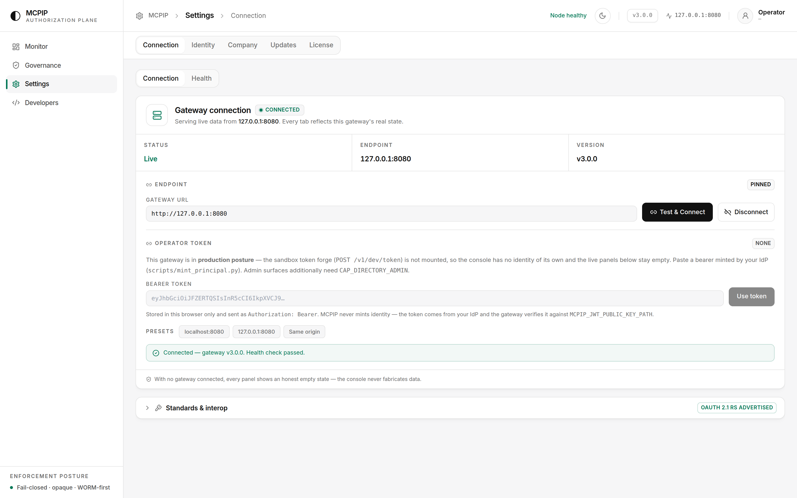

# End-to-end walkthrough — a real production cycle

Every command, input and output on this page was executed against a real MCPIP
`3.0.0` gateway in production posture. Nothing is illustrative: the Cloudflare and
GitHub responses are live API results, and the correlation ids and `worm_sequence`
values are the ones the gateway actually emitted.

> **Provenance — which run each section came from.** This page is assembled from two
> executions of the same procedure against the same build, and it says which is
> which rather than presenting them as one continuous session.
>
> - **§5, §6, §7, §9a and §12 were re-executed end to end in one session** for this
>   revision — one boot, one catalog, one ledger. Every identifier in them, down to
>   the Merkle root and the deleted stream id, comes from that single session.
> - **§11's step-up cycle** was re-executed on that same gateway, in production
>   posture, after enrolling a TOTP authenticator — see the note in that section.
> - **§1–§4** (the key ceremony, license, integrity manifest and the four refused
>   boots), **§8** (the provider responses) and **§13** (the console screenshots) are
>   from the original run. §8 needs live Cloudflare and GitHub credentials, which the
>   re-run environment does not have, so it was not re-captured.
> - **§10's capability matrix** was re-run against the same build and reproduced cell
>   for cell, including the auditor's `404`, so it is unchanged.

Two agents are governed end to end — a Cloudflare platform agent and a GitHub
release agent — plus the developer-facing path (SDK) and the operator-facing path
(console). Where a control could not be exercised in this environment, that is
stated rather than simulated.

**Contents**

1. [Key ceremony](#1-key-ceremony)
2. [License](#2-license)
3. [Boot integrity manifest](#3-boot-integrity-manifest)
4. [Production boot, and the four gates that refuse it](#4-production-boot-and-the-four-gates-that-refuse-it)
5. [Identity — minting principals](#5-identity--minting-principals)
6. [Catalog — registering the tool surface](#6-catalog--registering-the-tool-surface)
7. [Governed calls — Cloudflare and GitHub](#7-governed-calls--cloudflare-and-github)
8. [Execution — the authorized call against the real provider](#8-execution--the-authorized-call-against-the-real-provider)
9. [Developer path — the SDK](#9-developer-path--the-sdk)
10. [Developer vs operator — the capability boundary](#10-developer-vs-operator--the-capability-boundary)
11. [Step-up — the PIN cycle](#11-step-up--the-pin-cycle)
12. [Evidence — the WORM ledger](#12-evidence--the-worm-ledger)
13. [The operator console](#13-the-operator-console)
14. [What this run did not prove](#14-what-this-run-did-not-prove)

---

## 1. Key ceremony

Four Ed25519 keypairs, none of which the gateway may generate for itself. The
release and license roots are the offline signing identities; the WORM epoch key
signs the audit chain; the IdP key signs principal tokens and the gateway holds
only its public half.

```bash
python3 scripts/gen_release_keys.py      --keys-dir ./keys --public-dir ./pub
python3 scripts/provision_gateway_keys.py --keys-dir ./keys --public-dir ./pub
```

```
generated release-root: ed25519:859645e4f45c87b4
generated license-root: ed25519:6a43de9d6cca881c

MCPIP gateway key ceremony complete.
  WORM epoch-signing  ed25519:f498dc4757b3efba
    private (0600)    keys/worm_signing_ed25519.key   -> MCPIP_WORM_SIGNING_KEY_PATH
    public            pub/worm_signing_ed25519.pub.pem -> auditors
  IdP identity-signing ed25519:a2d94615b1240fb3
    private (0600)    keys/idp_signing_ed25519.key    -> the token minter, NEVER the gateway
    public            pub/idp_signing_ed25519.pub.pem -> MCPIP_JWT_PUBLIC_KEY_PATH
```

Only public material and key-id fingerprints are ever printed. The IdP private key
never reaches the gateway — identity is verify-only, which is what makes the
`agent_id` in an audit record non-repudiable.

## 2. License

The license gates **process boot only**. It is never consulted by the
authorization pipeline — entitlement is an operator/change-control matter, and
per-request authorization is the engine's. This separation is why a lapsed
license cannot silently change a decision.

```bash
python3 scripts/gen_license.py \
  --customer "Cloudflare Platform Ops" --tier self-hosted --days 90 \
  --entitlements authorize,mcp_edge,audit_export,metrics \
  --private-key keys/license_root_ed25519.pem --out state/license.json
```

```json
{
  "schema": "mcpip-license/1",
  "license_id": "e0d5437b-d0ae-4eb7-a8e4-c21a858166df",
  "customer": "Cloudflare Platform Ops",
  "tier": "self-hosted",
  "issued_at": "2026-07-29T10:57:21Z",
  "expires_at": "2026-10-27T10:57:21Z",
  "entitlements": ["audit_export", "authorize", "mcp_edge", "metrics"],
  "signing_key_id": "ed25519:6a43de9d6cca881c",
  "signature": "hKMhkfoMkObdL+Z4rI/Mbq9nxMbktk6VzD1CsJ/n+PW4x3TsIBGBf03ZXIb8PJxBPoHNHArZXYkpDWwGx1RQAA=="
}
```

The signature covers the canonical JSON of every field except `signature` itself,
so any edit to tier, customer or expiry invalidates it — demonstrated in §4.

## 3. Boot integrity manifest

```bash
python3 scripts/gen_integrity_manifest.py \
  --private-key keys/release_root_ed25519.pem --base-dir . --out state/integrity_manifest.json
```

```
integrity manifest: 85 files -> state/integrity_manifest.json
  key id: ed25519:859645e4f45c87b4
```

## 4. Production boot, and the four gates that refuse it

Production posture is `MCPIP_SANDBOX_MODE=false`. Four separate gates each
refused the boot before a valid configuration was reached. All four outputs below
are real refusals, not descriptions of them.

**Gate 1 — no license**

```
RuntimeError: production boot (MCPIP_SANDBOX_MODE=false) requires both
MCPIP_LICENSE_PATH and MCPIP_LICENSE_PUBLIC_KEY_PATH
```

**Gate 2 — license edited** (`tier: self-hosted → cloud`, `customer → Attacker Corp`,
signature left untouched)

```
RuntimeError: license verification failed
```

**Gate 3 — source tree modified after the manifest was signed**
(`echo "# injected backdoor" >> core/metrics.py`)

```
startup integrity self-check failed: hash mismatch: core/metrics.py
RuntimeError: integrity verification failed
```

**Gate 4 — Redis not fsync-durable**

```
RuntimeError: MCPIP WORM-DURABILITY: Redis persistence is appendonly=no
appendfsync=everysec maxmemory-policy=noeviction; write-before-execute requires
appendonly=yes appendfsync=always and maxmemory-policy=noeviction so the audit
buffer XADD is fsync-durable before /v1/authorize returns allow and WORM/replay
keys are never evicted.
```

Gate 4 is the write-before-execute contract in enforcement form: MCPIP will not
serve at all unless the ledger write is durable *before* an allow is returned.

With all four satisfied:

```
MCPIP connector registry v4 sha256=c755c47019d17271f2b1a8ccd30ff2020dc0b27beaa0466e1f3a49fbcafb622a
MCPIP LICENSE: verified license_id=e0d5437b-d0ae-4eb7-a8e4-c21a858166df tier=self-hosted expires_at=2026-10-27T10:57:21+00:00
MCPIP WARNING: MCPIP_REDIS_URL is plaintext (redis://) in production — the payload-lock
hashes, WORM buffer, and rate counters cross it unencrypted and unauthenticated. Use
rediss:// with a CA + AUTH/ACL, or ensure the Redis link is on an isolated internal-only network.
INFO:     Started server process
```

```console
$ curl -s http://127.0.0.1:8080/healthz
{"status":"live","glyph":"◐","loop":"uvloop","version":"3.0.0","region":null}
```

The plaintext-Redis line is a warning, not a refusal — network isolation is a
valid documented control, so the gateway says so loudly instead of breaking an
isolated deployment.

> **Note on `MCPIP_JWT_AUDIENCE`.** Production also refuses the shipped demo
> issuer/audience pair (`mcpip-demo-idp` / `mcpip-gateway`), because those values
> are published and predictable. Set both to values you control.

## 5. Identity — minting principals

Three principals, all signed by the IdP key, all in tenant `acme-platform`. Only
the third carries a capability.

```bash
python3 scripts/mint_principal.py --idp-key keys/idp_signing_ed25519.key \
  --tenant acme-platform --agent cf-platform-agent-1 --role platform-ops \
  --issuer prod-idp.hero --audience mcpip-gw.hero --ttl 3600 --out cf.jwt
```

Decoded claims:

```json
{
  "iss": "prod-idp.hero",
  "aud": "mcpip-gw.hero",
  "tenant_id": "acme-platform",
  "agent_id": "cf-platform-agent-1",
  "role": "platform-ops",
  "exp": 1785748215, "iat": 1785744615, "nbf": 1785744615,
  "jti": "8945663e93c646b19b4ae5f038da0f40"
}
```

```console
$ curl -s -H "Authorization: Bearer $(cat cf.jwt)" http://127.0.0.1:8080/v1/whoami
{
    "tenant_id": "acme-platform",
    "agent_id": "cf-platform-agent-1",
    "role": "platform-ops",
    "compartment": null,
    "capabilities": [],
    "session_id": null,
    "sender_constrained": false
}
```

The operator principal is the same command plus one flag —
`--capability b8e4a1d7-2c6f-4e93-9a05-7f1c3b5d8e20` — and that single UUID is the
entire difference measured in §10.

`role` is descriptive and authorizes nothing. Entitlement is the capability UUID
list — empty here, which is exactly what §10 exploits.

## 6. Catalog — registering the tool surface

Aliases are registered by an operator holding `CAP_DIRECTORY_ADMIN`. Registration
is additive-only: an alias that already resolves cannot be overridden or shadowed.

```bash
curl -X POST http://127.0.0.1:8080/v1/admin/skills/register \
  -H "Authorization: Bearer $ADMIN" -H 'Content-Type: application/json' \
  -d '{"alias":"cf.d1.query",
       "target":"https://api.cloudflare.com/client/v4/accounts/{account_id}/d1/database/query",
       "risk_tier":"pin_required","classification":"restricted",
       "service":"cloudflare","access":"write"}'
```

| alias | risk tier | classification | service | access |
|---|---|---|---|---|
| `cf.d1.databases.list` | `auto` | `unclassified` | cloudflare | read |
| `cf.d1.query` | `pin_required` | `restricted` | cloudflare | write |
| `gh.branches.list` | `auto` | `unclassified` | github | read |
| `gh.repo.delete` | `pin_required` | `restricted` | github | write |

What the **agent** sees — the whole visible surface, aliases only, never the real
provider URLs. This is the complete response, not an excerpt:

```console
$ curl -s -H "Authorization: Bearer $AGENT" http://127.0.0.1:8080/v1/catalog
{
    "catalog": [
        {"alias": "cf.d1.databases.list", "risk_tier": "auto",
         "transport_class": "cloud_rest", "classification": "unclassified",
         "compartment": null, "access": "read"},
        {"alias": "cf.d1.query", "risk_tier": "pin_required",
         "transport_class": "cloud_rest", "classification": "restricted",
         "compartment": null, "access": "write"},
        {"alias": "gh.branches.list", "risk_tier": "auto",
         "transport_class": "cloud_rest", "classification": "unclassified",
         "compartment": null, "access": "read"},
        {"alias": "gh.repo.delete", "risk_tier": "pin_required",
         "transport_class": "cloud_rest", "classification": "restricted",
         "compartment": null, "access": "write"}
    ]
}
```

Note what this does **not** do: it does not hide the GitHub aliases from a
Cloudflare agent. Visibility is scoped by tenant and by **compartment**, not by
service name — every alias here has `"compartment": null`, and an un-compartmented
alias is visible to **every** principal in the tenant. Narrowing this agent to the
`cf.*` surface means registering the aliases you want hidden into a compartment and
minting each team's token with `--compartment <uuid>` (or issuing a delegated grant
to it). Nothing about the alias prefix does it for you.

Seeing an alias is also not permission to call it. `cf.d1.query` is listed, and §7
shows it denied. The catalog answers "what could I ask for", the choke point answers
"may I, this time, with this payload".

The alias indirection is the part that always holds: a compromised agent cannot
discover the account id, the hostname, or the credential from anything MCPIP hands
it, whatever it can see.

## 7. Governed calls — Cloudflare and GitHub

Each request is a standard MCP JSON-RPC 2.0 `tools/call` envelope with the wire
dialect **declared** (`vendor`), never sniffed from the payload.

### CF-1 — Cloudflare read, `auto` risk → allow

```json
{"vendor":"claude_code","tool_call":{"jsonrpc":"2.0","id":1,"method":"tools/call",
 "params":{"name":"cf.d1.databases.list","arguments":{}}}}
```

```json
{
  "correlation_id": "bedc0fa86d81463cb0bebb16f40c43b4",
  "decision": "allow",
  "status": "committed",
  "transaction_ref": "txn_35503175750b444eb9ca880e46f5e6ae",
  "executed_target_class": "cloud_rest",
  "worm_sequence": 5,
  "vended_credential": null
}
```
`HTTP 200`

### GH-1 — GitHub read, `auto` risk → allow

```json
{"vendor":"claude_code","tool_call":{"jsonrpc":"2.0","id":3,"method":"tools/call",
 "params":{"name":"gh.branches.list","arguments":{"owner":"mcpip-security","repo":"mcpip"}}}}
```

```json
{
  "correlation_id": "41e7192a9b3b4b6d97d3848d746c53be",
  "decision": "allow",
  "status": "committed",
  "transaction_ref": "txn_4b936a4c7d464790a7eefa911ec0559e",
  "executed_target_class": "cloud_rest",
  "worm_sequence": 7,
  "vended_credential": null
}
```
`HTTP 200`

### CF-2 / GH-2 — destructive calls → denied

`DROP TABLE customers` through `cf.d1.query`, and `gh.repo.delete` against this
very repository. Both responses, in full:

```json
{"error": "MCPIP: request denied by policy.",
 "correlation_id": "d9930470c28745b1b490c2a531972d3f"}
```
```json
{"error": "MCPIP: request denied by policy.",
 "correlation_id": "e0b4bd3a19674364a2d206a70850fed2"}
```
`HTTP 403` for both

### X-2 — the GitHub agent reaching for a Cloudflare alias

A plain `SELECT`, from the release agent, against an alias it can see in the
catalog:

```json
{"vendor":"claude_code","tool_call":{"jsonrpc":"2.0","id":5,"method":"tools/call",
 "params":{"name":"cf.d1.query","arguments":{"sql":"SELECT * FROM customers"}}}}
```

```json
{"error": "MCPIP: request denied by policy.",
 "correlation_id": "d904b27e67264f298dc7108ffa727462"}
```
`HTTP 403`

Read §14 before drawing the wrong conclusion from this one: both agents are in the
same tenant with no compartment, so this refusal came from the `pin_required` risk
gate, not from any separation between the two agents.

### X-1 — an alias that was never registered

```json
{"vendor":"claude_code","tool_call":{"jsonrpc":"2.0","id":6,"method":"tools/call",
 "params":{"name":"gh.secrets.exfiltrate","arguments":{}}}}
```

```json
{"error": "MCPIP: request denied by policy.",
 "correlation_id": "1d0b7026905d45748dabdf16ac395ab5"}
```
`HTTP 403`

Every denial returns the **same opaque body**. The caller learns only that it was
denied — never whether the alias exists, whether it is restricted, or which gate
fired. The concrete reason goes to the ledger, not to the agent (§12).

## 8. Execution — the authorized call against the real provider

MCPIP authorizes; the caller executes. These are the live provider responses for
the two calls allowed in §7.

**Cloudflare**, after `worm_sequence 5`:

```json
{"result":[{"uuid":"ee77852d-639f-4874-860f-6a32be479d24","name":"mcpip-site",
  "created_at":"2026-07-21T23:06:19.622Z","version":"production",
  "num_tables":0,"file_size":114688,"jurisdiction":null}],
 "result_info":{"count":1,"page":1,"per_page":100,"total_count":1}}
```

**GitHub**, after `worm_sequence 7`:

```json
[{"name":"claude/new-session-6g22zk","sha":"75751e2ef1d7e777854e5703b4f14528f82ce148","protected":false},
 {"name":"dependabot/github_actions/actions/checkout-7","sha":"2e686a4e97a1c73a97312a736e0f06392952ba7a","protected":false}]
```

The denied calls in §7 were never executed against either provider.

## 9. Developer path — the SDK

A developer integrates through the SDK rather than raw HTTP. Same gateway, same
decisions.

```python
from mcpip_sdk import MCPIPClient, MCPIPDenied

c = MCPIPClient("http://127.0.0.1:8080", token=agent_jwt)

print(c.health())
for item in c.catalog():
    print(item)

r = c.authorize(vendor="claude_code", tool_call={
    "jsonrpc": "2.0", "id": 1, "method": "tools/call",
    "params": {"name": "cf.d1.databases.list", "arguments": {}}})
print(r)

try:
    c.authorize(vendor="claude_code", tool_call={
        "jsonrpc": "2.0", "id": 2, "method": "tools/call",
        "params": {"name": "cf.d1.query", "arguments": {"sql": "DROP TABLE customers"}}})
except MCPIPDenied as e:
    print("denied:", e)
```

```
Health(status='live', glyph='◐', loop='uvloop', version='3.0.0')
VersionInfo(running='3.0.0', latest='3.0.0', update_available=False, channel='self-hosted', ...)

CatalogItem(alias='cf.d1.databases.list', risk_tier='auto', transport_class='cloud_rest', classification='unclassified', compartment=None)
CatalogItem(alias='cf.d1.query',          risk_tier='pin_required', transport_class='cloud_rest', classification='restricted',  compartment=None)
CatalogItem(alias='gh.branches.list',     risk_tier='auto', transport_class='cloud_rest', classification='unclassified', compartment=None)
CatalogItem(alias='gh.repo.delete',       risk_tier='pin_required', transport_class='cloud_rest', classification='restricted',  compartment=None)

Allowed(correlation_id='0dd455de98d84f35a8bf2d9faa84652c', decision='allow',
        status='committed', transaction_ref='txn_b71559f7d58946629a5c28ac2dc953ac',
        executed_target_class='cloud_rest', worm_sequence=11, vended_credential=None)

denied: MCPIP: request denied by policy.
```

The denial surfaces as a typed `MCPIPDenied` exception carrying the same opaque
message the HTTP caller saw — the SDK does not widen the disclosure.

## 9a. Developer path — the other integration options

The SDK above is one of five supported ways in. All five hit the same choke point
and get the same decision; they differ only in what the calling code looks like.

**Option 1 — raw HTTP.** `POST /v1/authorize`, shown throughout §7. No dependency
beyond an HTTP client.

**Option 2 — Python / TypeScript SDK.** §9. Typed results, `MCPIPDenied` for
refusals, staged step-up handled by `complete()`.

**Option 3 — MCP-native edge.** `POST /v1/mcp` speaks JSON-RPC directly, so an MCP
host can treat the gateway itself as a server and get a catalog that is already
filtered to what this identity may see:

```console
$ curl -X POST http://127.0.0.1:8080/v1/mcp -H "Authorization: Bearer $AGENT" \
    -d '{"jsonrpc":"2.0","id":1,"method":"tools/list"}'
{"jsonrpc":"2.0","id":1,"result":{"tools":[
  {"name":"cf.d1.databases.list","description":"risk_tier=auto; classification=unclassified","inputSchema":{"type":"object"}},
  {"name":"cf.d1.query","description":"risk_tier=pin_required; classification=restricted","inputSchema":{"type":"object"}},
  {"name":"gh.branches.list","description":"risk_tier=auto; classification=unclassified","inputSchema":{"type":"object"}},
  {"name":"gh.repo.delete","description":"risk_tier=pin_required; classification=restricted","inputSchema":{"type":"object"}}],
 "coaz":true}}
```

The risk tier travels in the tool description, so a well-behaved host can warn
before it proposes a `pin_required` call. The extra `"coaz": true` is additive
advertising — MCP clients ignore result keys they do not know, and a COAZ-aware one
learns from it that this gateway also exposes the AuthZEN decision surface in
Option 5.

**Option 4 — the `mcpip` CLI**, shipped with the Python SDK:

```console
$ mcpip --help
usage: mcpip [-h] [--gateway URL] [--context NAME] [--sandbox | --no-sandbox]
             [--config PATH] [--token-file PATH] [--token-stdin]
             [--token-cmd CMD] [--json] [--quiet] [--no-color] [--version]
             <command> ...

MCPIP — authorize every AI action before execution.

Local sandbox in one command:   mcpip up
Zero to authorized in three:    mcpip login, mcpip sandbox dev-token,
                                mcpip authorize

positional arguments:
  <command>
    up                  boot the local sandbox stack — Redis + gateway + live
                        walkthrough, one command
    login               validate reachability and save a context
    whoami              decode the active bearer and confirm the gateway
                        accepts it
    config              read/write the config file
    context             manage named contexts
    catalog             list the aliases this identity may see
    authorize           authorize one tool call through the choke point
    complete            finish a staged step-up from the persisted envelope
    why                 explain a denial from its correlation id
    verify              verify a signed release or air-gap bundle (read-only)
    export-audit        export the WORM audit stream, optionally re-verifying
                        the signed chain
    decision            ask for an AuthZEN PDP verdict (nothing executes)
    mcp                 speak the MCP JSON-RPC edge
    health              liveness probe (unauthenticated)
    ready               readiness (503 is an honest ready=false)
    version             running release + provenance
    license             boot-verified entitlement view
    discovery           public RFC 9728 resource metadata (no token)
    audit               audit surfaces
    sandbox             sandbox-only affordances (404 in production)
    admin               the CAP_DIRECTORY_ADMIN control plane

options:
  -h, --help            show this help message and exit
  --version             print the CLI + SDK version and exit (no gateway call)

global options:
  --gateway URL         gateway base URL
  --context NAME        named context to use
  --sandbox, --no-sandbox
                        treat the gateway as a sandbox (--no-sandbox to force
                        off)
  --config PATH         alternate config file
  --token-file PATH     read the bearer from a 0600 file
  --token-stdin         read the bearer from stdin
  --token-cmd CMD       run CMD; its stdout is the bearer
  --json                emit JSON
  --quiet, -q           print only load-bearing ids
  --no-color            disable colored output
```

`audit`, `sandbox` and `admin` are groups — `mcpip admin --help` lists the control
plane underneath them.

Named contexts plus `--token-cmd` mean a developer can point the same commands at
sandbox and production without a token ever landing in shell history.

**Option 5 — PDP mode.** `POST /v1/authz/decision` returns an AuthZEN verdict and
executes nothing, for teams that already have an enforcement point and want MCPIP
only as the decision point.

## 10. Developer vs operator — the capability boundary

Both principals come from the same IdP and the same tenant. The only difference is
one capability UUID (`CAP_DIRECTORY_ADMIN`,
`b8e4a1d7-2c6f-4e93-9a05-7f1c3b5d8e20`) in the token claims.

| endpoint | developer token | operator token |
|---|---|---|
| `GET /v1/whoami` | `200` | `200` |
| `GET /v1/catalog` | `200` | `200` |
| `GET /v1/admin/decisions/recent` | **`403`** | `200` |
| `GET /v1/admin/stats` | **`403`** | `200` |
| `POST /v1/admin/skills/register` | **`403`** | `200` |

A developer can see the catalog and get calls authorized. A developer cannot read
other agents' decisions, read tenant statistics, or register a new alias — so
self-granting a route to a new target is not available to the identity that would
most benefit from it. `role: "platform-ops"` in the token changes none of this.

### The other personas

Four more principal types were exercised against the same gateway. Capabilities
are **non-hierarchical** — note that the operator is refused two routes:

| route | agent | developer | operator | auditor | reviewer |
|---|---|---|---|---|---|
| `GET /v1/catalog` | `200` | `200` | `200` | `200` | `200` |
| `POST /v1/authorize` | `200` | `200` | `200` | `200` | `200` |
| `GET /v1/admin/stats` | `403` | `403` | `200` | `403` | `403` |
| `GET /v1/admin/decisions/recent` | `403` | `403` | `200` | `403` | `403` |
| `POST /v1/admin/skills/register` | `403` | `403` | `200` | `403` | `403` |
| `GET /v1/admin/forensic/{corr}` | `403` | `403` | **`403`** | `404`¹ | `403` |
| `GET /v1/admin/extensions/pending` | `403` | `403` | **`403`** | `403` | **`200`** |

¹ `404` not `403`: the auditor is authorized, but no forensic capture existed for
that correlation id. An authorized-but-empty lookup is distinguishable from a
capability refusal.

`CAP_DIRECTORY_ADMIN` does not subsume `CAP_FORENSIC_READ` or
`CAP_CATALOG_REVIEWER`. There is no super-admin: compromising the operator does
not yield payload forensics or extension approval.

A worked multi-agent, multi-persona run — including a live revocation during
concurrent traffic — is in [`ORGANIZATION_AT_SCALE.md`](ORGANIZATION_AT_SCALE.md).

## 11. Step-up — the PIN cycle

`pin_required` aliases stage rather than allow. The cycle below was run **in
production posture**, on the same gateway as §7.

That is worth saying plainly, because a `pin_required` call in §7 failed closed with
`otp_delivery_failed` and it would be easy to conclude production cannot complete
one. It can. What the earlier calls lacked was not a webhook — it was an **enrolled
authenticator**. Set `MCPIP_AUTHN_TOTP_KEY_PATH` and enroll the principal once
(`POST /v1/authenticator/enroll`, then `/enroll/confirm` with a code from the
authenticator app) and the gateway has an out-of-band channel it can reach a human
on, without any outbound HTTP at all:

```console
$ curl -s -X POST http://127.0.0.1:8080/v1/authenticator/enroll \
    -H "Authorization: Bearer $AGENT"
{"secret": "...", "provisioning_uri": "otpauth://totp/MCPIP:cf-platform-agent-1?...",
 "digits": 6, "period_s": 30}
```

The provisioning material is returned **exactly once**, and re-enrolling over a live
authenticator is refused — swapping someone's second factor takes the disable
ceremony and a valid current code, so a stolen bearer alone cannot do it.

**Stage** — no allow is issued:

```json
{
  "correlation_id": "8bb7bd187d124673bf9cdcfaeb615654",
  "action_required": "Step-up required: approve in your enrolled authenticator to obtain a one-time code, then resubmit with pin + challenge_id.",
  "challenge_id": "10b345070b784a1090b17502b97e0aa3",
  "risk_tier": "pin_required"
}
```
`HTTP 202`

**Release the payload-bound code** with a fresh code from the enrolled
authenticator. This is `POST /v1/authenticator/reveal`, and it is not a sandbox
affordance — it is the production ceremony. The release is single-use (`GETDEL`) and
is WORM-logged *before* the code is returned; the code itself never enters the
record:

```console
$ curl -s -X POST http://127.0.0.1:8080/v1/authenticator/reveal \
    -H "Authorization: Bearer $AGENT" -H 'Content-Type: application/json' \
    -d '{"challenge_id":"10b345070b784a1090b17502b97e0aa3","code":"<6-digit TOTP>"}'
{"challenge_id": "10b345070b784a1090b17502b97e0aa3", "otp": "935150"}
```
`HTTP 200`

Two distinct secrets are in play, and conflating them is the usual mistake: the
**TOTP code** proves a human is present, and the **OTP** it releases is bound to the
canonical hash of *this* payload. Proving presence does not authorize an action; it
only unseals the lock for the one action already staged.

**Complete** — resubmit the identical payload with `pin` + `challenge_id`:

```json
{
  "correlation_id": "fb35ebced06543aebb78833e28650ac5",
  "decision": "allow",
  "status": "committed",
  "transaction_ref": "txn_5501ea7e525647039ddbd209e6641eca",
  "executed_target_class": "cloud_rest",
  "worm_sequence": 16,
  "vended_credential": null
}
```
`HTTP 200`

**Replay the same PIN** — the lock is exactly-once:

```json
{"error": "MCPIP: request denied by policy.",
 "correlation_id": "9c50d6e609a6406ebccccd593b6a3945"}
```
`HTTP 403`

**Reveal the same challenge again** — so is the release:

```json
{"error": "MCPIP: request denied by policy.",
 "correlation_id": "67a1c57740b64332bd1cb40455a27219"}
```
`HTTP 403`

The code is bound to the canonical payload hash, so an approval for
`DROP TABLE customers` cannot be replayed to authorize a different statement, and
cannot be replayed at all a second time. The refusals are opaque and identical: a
spent lock and a challenge that never existed are indistinguishable to the caller.

## 12. Evidence — the WORM ledger

The agent got one opaque message for every denial. The ledger has the reasons:

```
seq  decision  deny_reason            alias                  agent                correlation_id
  5  allow     None                   cf.d1.databases.list   cf-platform-agent-1  bedc0fa86d81463cb0bebb16f40c43b4
  6  deny      otp_delivery_failed    cf.d1.query            cf-platform-agent-1  d9930470c28745b1b490c2a531972d3f
  7  allow     None                   gh.branches.list       gh-release-agent-1   41e7192a9b3b4b6d97d3848d746c53be
  8  deny      otp_delivery_failed    gh.repo.delete         gh-release-agent-1   e0b4bd3a19674364a2d206a70850fed2
  9  deny      otp_delivery_failed    cf.d1.query            gh-release-agent-1   d904b27e67264f298dc7108ffa727462
 10  deny      unknown_alias          gh.secrets.exfiltrate  gh-release-agent-1   1d0b7026905d45748dabdf16ac395ab5
```

The signed attestation at the ledger head. `epoch` is the newest **sealed** epoch;
because each epoch's `epoch_hash` chains the one before it, this single signature
commits to every record above, not only to the epoch it names:

```console
$ curl -s -H "Authorization: Bearer $ADMIN" http://127.0.0.1:8080/v1/audit/attestation
{
    "epoch": 0,
    "end_seq": 10,
    "merkle_root": "8e1e8b6b5b05537f53f45b19a3e7d89a9d491a8f0c76d5d828742ba260ba9f6f",
    "epoch_hash": "7ddabda643dbaeeb0ae671894734d4858f94cbab643b3bfa3079becbf127ad76",
    "signature": "73b1384b6979afb618c7da8448895a32308e471b833fa560d21689ab67c77dbdad9aecbbdcc87d872cb04cb3008a0c0cd8227452d9d5b0be38a0bf6670d35004",
    "signing_key_id": "04121a608f7cd6853e2e2fce9d13963cd526cf4f5e0aea85010a6ff2c3e98fe6",
    "intact": true,
    "first_bad_epoch": null,
    "anchor_epoch": 0,
    "anchor_epoch_hash": "7ddabda643dbaeeb0ae671894734d4858f94cbab643b3bfa3079becbf127ad76"
}
```

`anchor_epoch` is the same head read back from the out-of-tamper-domain anchor file
— a second, independent witness that lives outside Redis, so rolling the database
back cannot roll the head back with it.

### Tamper detection

One sealed event was deleted directly from the ledger's backing store, bypassing the
gateway entirely. The chosen record is `worm_sequence` 5 — the **allowed** Cloudflare
read, which is the record an attacker actually wants gone:

```console
$ redis-cli -p 63795 xdel mcpip:worm:events 1785745222541-0
1
```

Re-verification, same endpoint, no restart:

```json
{
    "epoch": 0,
    "end_seq": 10,
    "merkle_root": "8e1e8b6b5b05537f53f45b19a3e7d89a9d491a8f0c76d5d828742ba260ba9f6f",
    "epoch_hash": "7ddabda643dbaeeb0ae671894734d4858f94cbab643b3bfa3079becbf127ad76",
    "signature": "73b1384b6979afb618c7da8448895a32308e471b833fa560d21689ab67c77dbdad9aecbbdcc87d872cb04cb3008a0c0cd8227452d9d5b0be38a0bf6670d35004",
    "signing_key_id": "04121a608f7cd6853e2e2fce9d13963cd526cf4f5e0aea85010a6ff2c3e98fe6",
    "intact": false,
    "first_bad_epoch": 0,
    "anchor_epoch": 0,
    "anchor_epoch_hash": "7ddabda643dbaeeb0ae671894734d4858f94cbab643b3bfa3079becbf127ad76"
}
```

**Read the two side by side: every signed field is byte-identical.** Same `epoch`,
same `end_seq`, same `merkle_root`, same `epoch_hash`, same `signature`. That is the
mechanism, not a coincidence — the deletion cannot reach the commitment, because the
commitment was signed when the epoch sealed and is checked against a key the database
does not hold. What changes is the *recomputation*: rebuilding the epoch's Merkle tree
from the events that remain no longer reproduces the root that was signed, so `intact`
flips to `false` and `first_bad_epoch` names the epoch — which is where an
investigator starts reading.

An operator with database access can destroy a record. They cannot destroy the
*evidence* that a record was destroyed, and they cannot make the ledger lie about
where it happened.

## 13. The operator console

### 13.1 Giving the console an identity

The console has no identity of its own on a production gateway. It normally mints
one via `POST /v1/dev/token` — a **sandbox affordance** that returns `404` when
`MCPIP_SANDBOX_MODE=false`. Connect it to a production gateway and it says so,
and takes a real bearer minted by your IdP:



The token is stored in that browser only and sent as `Authorization: Bearer`.
MCPIP never mints identity — the gateway verifies the bearer against
`MCPIP_JWT_PUBLIC_KEY_PATH`, exactly as it does for an agent. Admin surfaces
additionally require `CAP_DIRECTORY_ADMIN`; a bearer without it authenticates
fine and simply gets `403` on those reads.

### 13.2 The console on live production traffic

With the token pinned, the same production gateway drives every panel — this is
the fleet from §7 and [`ORGANIZATION_AT_SCALE.md`](ORGANIZATION_AT_SCALE.md)
running while the screenshot was taken:


**133 decisions (111 allow · 22 deny)**, **3.2 decisions/s**, **p50 3.9 ms**, and
50 rows in the stream. Each row is a 1:1 projection of a WORM record: timestamp,
alias, `agent_id`, tenant, transport, the `#worm_sequence`, the verdict, and the
event id. The `data-agent-1` rows carry `otp_delivery_failed` — the same
production step-up refusal as §12, visible per call.

Note the audit-chain tile reads **Unverified · external verifier required**. That
is correct rather than a failure: `/v1/audit/verify` is sandbox-gated, so in
production the console will not claim a verdict it cannot obtain. The signed
attestation in §12 and `mcpip-verify export-audit --redis-url <URL> --out audit.jsonl --verify --pubkey worm_signing_ed25519.pub.pem` are the production paths. The verifier ships in the
gateway distribution as `mcpip-verify`; the SDK's `mcpip export-audit` passes through to it.

### 13.3 Against a sandbox gateway

For comparison, the same console against a sandbox gateway, where it mints its
own identity and can verify the chain in-place:


**Audit chain Intact · seq #12 · epoch 2** — the verdict the production view
correctly declines to assert. The footer states the posture both runs
demonstrated: *fail-closed · opaque · WORM-first*.

## 13a. From a number back to the records — the SOC 2 report

§12 shows six records. An auditor asks about ninety days. `/v1/audit/attestation`
answers "is the ledger intact *now*"; a Type II engagement is about a *period*.

`scripts/soc2_report.py` closes that gap by composing surfaces the gateway already
exposes — the cursor-paged decision history (`GET /v1/admin/decisions`), the
signed attestation, the compliance bundle, and the running version and
entitlement — into a period report where **every figure carries the records
behind it**.

```bash
python3 scripts/soc2_report.py \
  --gateway http://127.0.0.1:8080 --token-file operator.jwt \
  --days 90 --out report.md --json report.json
```

```
report -> report.md  (225 decisions, coverage=exhausted)
```

Real output from this run:

```markdown
| Period start        | 2026-07-28T11:41:12Z |
| Period end          | 2026-07-29T11:41:12Z |
| Tenant              | acme-platform        |
| Running version     | 3.0.0                |
| Entitlement         | self-hosted (e0d5437b-d0ae-4eb7-a8e4-c21a858166df) |
| Decisions in period | 225                  |
| worm_sequence range | 11–238               |

## Coverage of this report
The decision history was walked to exhaustion — 2 page(s), 228 row(s) scanned.

## Signed ledger commitment (period end)
| Chain intact  | True |
| Epoch         | 33   |
| End sequence  | 238  |
| Merkle root   | 81c4a9b6056f582358fac0a9ea0eeb86f6a1bc34a59b6fe60ad65d0d5218536d |
| Signing key id| 090da9528a854204cffe2d461e4b6826867a2d6c86543b8ca689ba4c56d17bf9 |

### Outcomes
| value   | count | share | worm_sequence range | sample correlation ids |
| allow   | 187   | 83.1% | 11–237              | 53cface29248…, bf7073ec27cd…, … |
```

Three properties make it auditable rather than merely informative:

- **Coverage is stated before any figure.** The report says whether the history
  was walked to exhaustion, truncated at the page cap, or cut short by a failed
  read. A truncated walk is labelled a lower bound, not a total.
- **Every bucket is traceable.** Each row carries its `worm_sequence` range and
  sample correlation ids, so "22 denials" is 22 records you can re-fetch by id —
  not a number you have to trust.
- **The figures are bound to a signed commitment.** The period-end Merkle root,
  epoch hash, signature and key id are printed, so an auditor can re-derive the
  root from an export and check the signature **without trusting the report or
  the gateway that produced it**. If `intact=false`, the report says so at the
  top, and the script exits non-zero.

The control mapping is phrased as evidence throughout — "this mechanism provides
evidence FOR this criterion" — never as a pass. Whether a control is satisfied is
an auditor's determination, not software's. See
[`COMPLIANCE.md`](../operate/COMPLIANCE.md) for the full clause mapping.

## 14. What this run did not prove

- **Webhook push.** `MCPIP_AUTHN_WEBHOOK_URL` and `MCPIP_AUTHN_WEBHOOK_SECRET_PATH`
  were unset for §7, so those `pin_required` calls failed closed with
  `otp_delivery_failed` (seq 6, 8, 9 above) — correct behaviour with no channel to
  reach a human on. §11 then completed the full cycle in the same production posture
  using an enrolled TOTP authenticator instead, so what remains untested here is the
  *webhook* channel specifically, not step-up in production.
- **Cross-tenant isolation.** Both agents shared tenant `acme-platform`, so the
  seq-9 denial (`gh-release-agent-1` reaching for `cf.d1.query`) came from the
  risk gate, *not* from tenant or compartment separation. Compartment scoping is
  a separate control and was not exercised here.
- **The background integrity monitor.** `_audit_integrity_daemon` runs every 300 s
  and had not re-run when the tamper was introduced, so the metric still read
  `mcpip_audit_integrity_total{event="verified"} 1.0`. Detection in §12 came from
  the on-demand attestation endpoint, which runs the same `verify_chain`.
- **Signed release verification.** The gateway reported
  `ReleaseProvenance(version='2.0.0', verified=False)` — this build was not
  produced by the signed release ceremony in `docs/operate/RELEASE.md`.
- **Real R2.** `r2_buckets_list` returned `Please enable R2 through the Cloudflare
  Dashboard`, so the Cloudflare execution in §8 used D1 instead.

---

**Measuring your own flow.** `scripts/e2e_flow_timing.py` is a timing harness for
the same paths this document walks — as an app (MCP), the SDK and the CLI, as
both a plain user and an admin, including token issuance and forensic
reconstruction. Every segment is a real wall-clock measurement against a running
sandbox gateway; nothing is estimated. Run instructions are in its docstring.
